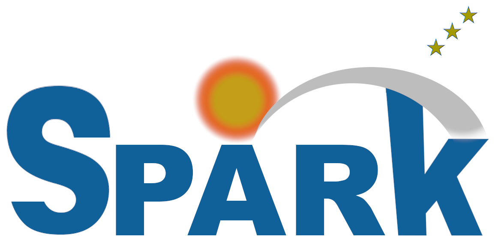

<b>SPARK: simulation and search for exact or approximate Turing Machines</b>. 

This program schools, simulates, and searches for exact or approximate Turing machines (TMs) with specific characteristics. It uses alignment-free approaches for searching the tapes and ascii color for beter understanding. Time (sleep) changes are flexible and well as modes.

## INSTALLATION ##

CMake is needed for installation (http://www.cmake.org/). CMake can be downloaded directly from http://www.cmake.org/cmake/resources/software.html or by any appropriate packet manager. In the following instructions we show the procedure to install, compile, and run SPARK:

<pre>
sudo apt-get install cmake git
git clone https://github.com/cobilab/spark.git
cd spark/src/
cmake .
make
</pre>

## EXECUTION

### Run SPARK

Run SPARK

<pre>
./SPARK 
</pre>

## PARAMETERS

To see the possible options type
<pre>
./SPARK
</pre>
or
<pre>
./SPARK -h
</pre>
this will output the following
<pre>
                                                                     
     ███████  ███████  ███████  ███████  ██   ███                    
     ██       ██   ██  ██   ██  ██   ██  ██  ███                     
     ███████  ███████  ███████  ███████  ██████                      
          ██  ██       ██   ██  ██ ███   ██  ███                     
     ███████  ██       ██   ██  ██  ███  ██   ███                    
                                                                     
NAME                                                                 
     SPARK, v1-r1.                                                 
                                                                     
SYNOPSIS                                                             
     ./SPARK [OPTION]...                                             
                                                                     
DESCRIPTION                                                          
     This program schools, simulates, and searches for exact or      
     approximate Turing machines (TM) w/ specific characteristics.   
                                                                     
ARGUMENTS                                                            
     -h,        --help,                 give this help,              
     -a,        --about,                display extra info,          
     -x,        --version,              display version number,      
     -v,        --verbose,              verbose mode (more info),    
     -f,        --force,                force output overwrite,      
     -t,        --threads,              number of threads (df:4),   
                                                                     
     -sc,       --skip-complexity,      skip complexity process,     
     -ht,       --hide-tape,            hide tape output,            
     -sa,       --show-all-tape,        show all tape iterations,    
     -hr,       --hide-rules,           hide rules in top file,      
                                                                     
     -rt,       --random-tape,          random tape (input size),    
                                                                     
     -is <INT>, --initial-state <INT>,  initial state to start,      
     -as <INT>, --alphabet-size <INT>,  alphabet cardinality,        
     -sn <INT>, --states-number <INT>,  number of states,            
     -ms <INT>, --max-time <INT>,       maximum time before halt,    
     -ma <INT>, --max-amplitude <INT>,  maximum tape amplitude,      
     -ia <INT>, --min-amplitude <INT>,  minimum tape amplitude,      
                                                                     
     -al <STR>, --alphabet <STR>,       alphabet to use (String),    
                                                                     
     -rs <INT>, --seed <INT>,           seed in random generation,   
     -dl <INT>, --delay <INT>,          visualization delay (ms),    
     -tp <INT>, --top <INT>,            high complexity top tapes,   
     -co <INT>, --ctx <INT>,            complexity context order,    
     -th <DBL>, --threshold <DBL>,      threshold: NC(3) | NRC(4),   
                                                                     
     -md <INT>, --mode <INT>,           running SPARK modes:         
                                          1 - School (simple),       
                                          2 - School (advanced),     
                                          3 - NC-Complexity top,     
                                          4 - NRC search,            
                                          5 - X search,              
                                          6 - Impossible,            
                                                                     
     -ot <FILE>, --output-tape <FILE>,  output TM tape to file,      
     -ox <FILE>, --output-top  <FILE>,  output complexity top,       
     -ir <FILE>, --input-rules <FILE>,  load input rules for TM,     
                                                                     
     -i <FILE>, --input <FILE>,         input sequence filename.     
                                                                     
EXAMPLES                                                             
     ./SPARK --alphabet-size 5 --states-number 5 --input seq.txt     
     ./SPARK --top 50 --mode 3 --states-number 9 --input seq.txt     
                                                                     
COPYRIGHT                                                            
     Copyright 2017-2023, D. Pratas, IEETA, University of Aveiro.    
     License GPLv3, GNU GPLv3 <http://gnu.org/licenses/gpl.html>. 

</pre>

## CITATION ##

On using this software/method please cite:

<pre>
SPARK: a C program for simulating and searching for exact or
approximate Turing machines (TM) with specific characteristics. 
D. Pratas. https://github.com/cobilab/spark.
</pre>

## ISSUES ##

For any issue let us know at [issues link](https://github.com/cobilab/spark/issues).

## LICENSE ##

GPL v3.

For more information:
<pre>http://www.gnu.org/licenses/gpl-3.0.html</pre>

